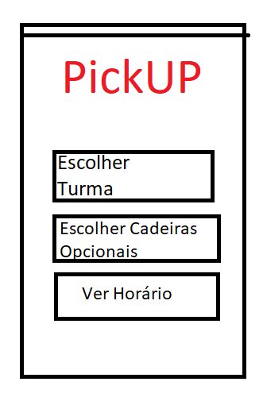

# 2LEIC04T1

## Members
 - Guilherme de Sousa Carvalho -202005369
 - José Miguel Moreira Isidro - 202006485
 - Francisco Rafael Pereira Teixeira - 202006111
 - José Leandro Rodrigues da Silva - 202008061
 - Luis Filipe Pinto Cunha - 201709375

# PickUP
### App Draft

  

## Vision Stament
O processo de inscrição nas unidades curriculares e nas turmas no Sigarra embora seja um processo extremamente simples, quem acede ou tenta efetuar o registo pelo telemóvel tem grandes dificuldades em concretizar a sua inscrição. Deste modo, a PickUP visa melhorar este acesso através de uma mini-app integrada na app UNI, na qual será possível fazer a inscrição nas cadeiras e também nas turmas de forma interativa, visual e intuitiva. 

## Main Features
 - <b>Inscrever nas cadeiras</b> - Aba para puder efetuar a inscrição nas cadeiras optativas através de uma interface visual e interativa do horário resultante. 
 - <b>Inscrever em turmas</b>   - Aba para puder efetuar a inscrição nas diversas turmas das cadeiras em que o estudante possui inscrição com uma interface visual e interativa do horário resultante. 
 - <b>Opção para poder ver o horário escolhido atualmente</b> - Aba para puder ver o horário atualmente escolhido tendo em conta as turmas e cadeiras escolhidas. 
 - <b>Visualizar turmas de cada Cadeira e os seus horários</b> - Permitir ver o horário de cada Turma em cada cadeira antes de efetuar a sua escolha, previsualizando o horário resultante se a escolha for efetuada. 
 - <b>Notificação em caso de abertura de vagas em turmas desejadas</b> -No caso de abertura de vagas em turmas desejadas o user é notificado através do envio de uma notificação para o dispositivo. 
...

## Required API's
- Acesso á posição no plano do estudante 
- Vagas disponíveis na cadeira  
- Horários de cada turma 
- Acesso as vagas na turma

